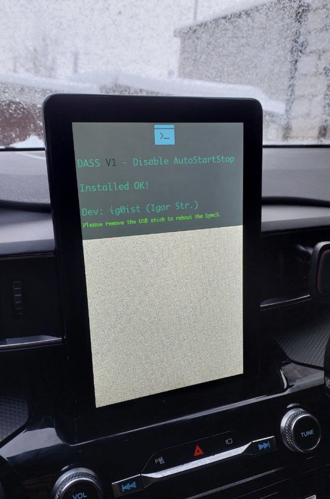
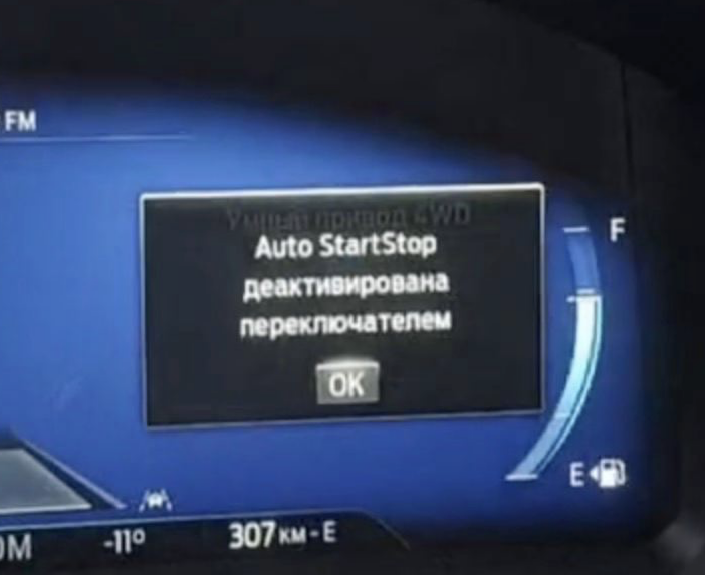
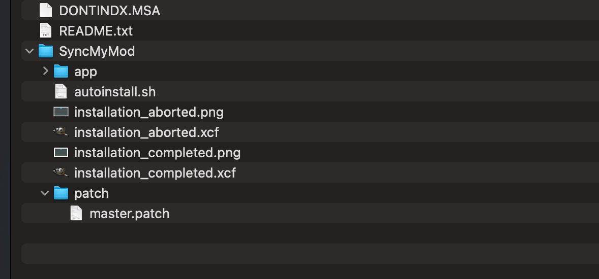

# DASS Disable AutoStartStop [ Sync3 MOD ] 


> [!WARNING]
> Tested only on 3.4.23188 

# Lincoln Aviator 2020 

Works out of the box


# Ford Explorer 2020 

Need edit as-built: `ASS Enabled` in  

[DE08/7D0-09-02 xxxx-xxxx-*xxx](https://cyanlabs.net/asbuilt-db/sync3-apim/?search=Park%2520Lock%2520Control%2520Allow%2520%28PLCA%29#database)







# Install 

1. Download MOD_1.0.zip 
2. Extract to USB, folder `SyncMyMod` must be in root



# The main idea in

Emulate pressing the Sync button to disable the ASS.

Realization:

* Find a common QML file for all types of screens.
* Add a timer that sets the time after which the emulation takes place.
* Add code emulate.


Emulator: 

```javascript

if (AL2HMIBridge.driverAssistSource.autoStartStopSupport) {
    console.log("DASS - autoStartStop Support , timer = ",AL2HMIBridge.driverAssistSource.autoStartStopStatusAutorepeatMs);
     // Check is active
    if (  AL2HMIBridge.driverAssistSource.autoStartStopStatus === AL2HMIBridge.DriverAssistSource.AutoStartStopStatus_Selected ) {
        console.log("DASS - Timer autoStartStop - NotPressed");
        // Тут магия 
        AL2HMIBridge.driverAssistSource.autoStartStopButtonPressed(AL2HMIBridge.DriverAssistSource.AutoStartStopButton_Pressed);
        AL2HMIBridge.driverAssistSource.autoStartStopButtonPressed(AL2HMIBridge.DriverAssistSource.AutoStartStopButton_NotPressed);
        // NOT
        AL2HMIBridge.driverAssistSource.autoStartStopButtonPressed(AL2HMIBridge.DriverAssistSource.AutoStartStopButton_Held);
        // HELD and ?
        AL2HMIBridge.driverAssistSource.autoStartStopButtonPressed(AL2HMIBridge.DriverAssistSource.AutoStartStopButton_NotPressed);
    } else {
        console.log("DASS - Error");
     }
} else {
    console.log("DASS - Not autoStartStop Support, sorry ");
}


```


# Check result in log 

```shell

cat /fs/rwdata/fordlogs/pas_debug.log | grep "DASS"

```


# Result 


*1. Patch all Root.QML*

All files in `/`, `+10inchL` & `+10inchP` and `+lincoln-MY20`


```javascript
import "dirpathedroot"

// ....


// START PathedRoot ----
Item {
    PathedRoot {
        // ---
    }
}
// END PathedRoot ----

// ....

```


*2. Make path dirpathedroot*

*3. Put dirpathedroot/PathedRoot.qml*


# Основная идея

Эмулировать нажатие кнопки на Sync отключение ASS.

Реализация:

* Найти общий для всех видов экранов файл QML.
* Добавить таймер, устанавливающий время через которое происходит - эмуляция. 

